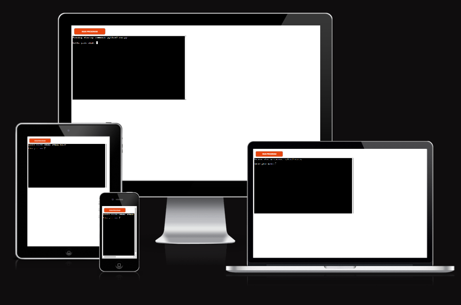
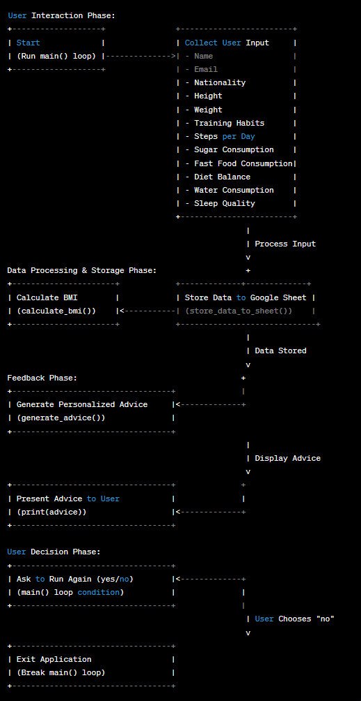

# Health Calculator

The Health Calculator is a Python-based application that calculates a user's Body Mass Index (BMI) and provides personalized health advice. It utilizes Google Sheets for data storage, which facilitates the easy tracking and analysis of health metrics over time.


## Table of Contents

- [Educational Use License](#educational-use-license)
- [Prerequisites](#prerequisites)
- [Installation](#installation)
- [Configuration](#configuration)
- [Usage](#usage)
- [Features](#features)
- [User Stories](#user-stories)
- [Constraints](#constraints)
- [Deployment](#deployment)
- [The Project Story](#the-project-story)
- [Workflow Chart](#workflow-chart)
- [Bugs and Issues](#bugs-and-issues)
- [Contributing](#contributing)
- [Credits](#credits)
- [Contact](#contact)
- [License Terms](#license-terms)


## Educational Use License

This project was developed as a part of the Portfolio Project 3 (PP3) within the Full Stack Developer program at the Code Institute. The source code is made available strictly for educational purposes and not for commercial use.

## Prerequisites

Before starting, ensure you have the following:

- Python 3.x installed on your system:
    https://www.python.org/downloads/
- A Google Cloud Platform account with the Sheets API enabled
    https://stateful.com/blog/google-sheets-api-tutorial
- A `creds.json` file with your Google service account credentials
    https://cloud.google.com/iam/docs/service-account-creds#:~:text=The%20Service%20Account%20Credentials%20API%20can%20create%20the,JSON%20Web%20Tokens%20%28JWTs%29%204%20Self-signed%20binary%20blobs

## Installation

To install the Health Calculator:

1. Clone the repository to your local machine:
   ```sh
   git clone https://github.com/Klurifixus/health-journey.git
   ```

## Configurations

    1. Place your 'creds.json' file in the root directory of the project.

    2. Open the 'creds.json' file and ensure it has the necessary permissions to access Google Sheets.
        1. Enabling the Google Sheets API and obtaining creds.json:
        2. Google Developers Console: Start by visiting the Google Developers Console.
        3. Setting up a project: Here is a Google guide for setting up a project in the Google API Console.
        4. Enable the API: You'll want to enable the Google Sheets API for your project. Google has documentation on enabling and disabling APIs.
        5. Creating credentials: For creating credentials (which will get you the creds.json), Google provides a step-by-step guide on creating credentials.
        6. Setting permissions in creds.json for Google Sheets:
            - Google Sheets API Documentation: You can refer to the Google Sheets API Documentation for detailed information on authorizing requests and setting proper permissions.
            - Google Cloud Documentation: Additionally, the Google Cloud Platform documentation on service account permissions can help you understand how to set permissions for your creds.json. 
## Usage

To use Health Calculator, run the following command in your terminal:
    * Run this command: 
    ```sh
    python run.py
    ```
Follow the interactive prompts to input your health data. The application will calculate your BMI and output personalized health advice.    

## Features
* BMI calculation based on the user's height and weight
* Interactive collection of health and lifestyle data
* Personalized health advice tailored to the user's BMI and lifestyle inputs
* Integration with Google Sheets for robust data management

### Future features
* Integration with Fitness Devices
* User Account System
* Advanced Data Visualization
* PDF Export and Sharing
* Mobile App Development

## User Stories
1. Calculate BM:
    * Is for a: health-conscious individual,
    * Who want to easily calculate Body Mass Index (BMI),
    * So they can quickly assess the general health status.

2. Receive Custom Health Advice:    
    * As someone looking to improve their lifestyle,
    * Want to receive personalized health advice,
    * So that they can make informed decisions about thier diet and exercise habits.

## Constraints
Keep in mind that the Heroku deployment terminal is set to 80 columns by 24 rows, so ensure your outputs are formatted to fit within this to prevent wrapping onto the next line.

## Deployment
This application can be deployed to Heroku. Ensure you have the Heroku CLI installed and follow these steps:

1. Log in to Heroku:
       
    * Run this command: 
    ```sh
    heroku login 
    ```
2. Create a new Heroku app:
    
    * Run this command: 
    ```sh
    heroku create
    ```
3. Push your code to Heroku:
    
    * Run this command: 
    ```sh
    git push heroku main
    ```
4. Ensure that at least one instance of the app is running:
    
    * Run this command: 
    ```sh
    heroku ps:scale web=1
    ```
5. Open the app in your browser:
    
    * Run this command:
    ```sh
     heroku open
    ```

### Creating the Heroku app

When creating your app on Heroku:
1. Add the heroku/python and heroku/nodejs buildpacks from the Settings tab in the specified order.

2. Create a Config Var named PORT and set it to '8000'.

3. If you have credentials like creds.json, create a CREDS Config Var and paste the JSON contents into the value field.

4. Connect your GitHub repository and deploy

## The Project Story
The development journey of the Health Calculator project has been a testament to the iterative and evolutionary nature of software development. Initially conceived as a command-line interface (CLI) application, the project ambitiously evolved into a web application due to my deep dive into a multitude of learning resources and my drive to exceed the project’s requirements. This exploration beyond the original scope not only reflects my passion for learning and development but also my commitment to delivering a comprehensive health tracking solution.

In the early stages, I invested substantial effort in mastering Python through various platforms, including YouTube and Udemy courses. This preparatory phase was instrumental in solidifying my programming foundation. As the coding commenced, my focus was on creating a functional and user-friendly application that could empower users to monitor and enhance their health.

The turning point came when, in consultation with my mentor and the Code Institute’s supportive community, it was brought to my attention that the project needed realignment with the original CLI specifications. The subsequent shift back to the CLI format was challenging and pressed for time. Despite the setback, the experience was enriching, serving as an incredible learning curve that sharpened my problem-solving skills and reinforced my adaptability as a developer.

I am profoundly thankful for the constructive feedback and guidance received, which directed the project back to its intended course and helped shape it into the Health Calculator presented here. The valuable insights gained from this experience have undoubtedly broadened my technical expertise and my perspective on the software development lifecycle.

As a testament to the growth and adaptability this project has demanded, I am proud to present the Health Calculator—a CLI application designed to offer insights into one’s well-being through BMI calculation and personalized health advice. It showcases the integration with Google Sheets, allowing users to track their health data systematically.

For a glimpse into an alternative vision that took shape during this project's development, I invite you to view the web application iteration, which stands as a reminder of the project’s broader potential and my continuous journey in software development:

https://vigorous-32e31799ae7b.herokuapp.com/

https://github.com/Klurifixus/Vigorous

As I continue on my path as a developer, the lessons learned and the knowledge gained from the Health Calculator project will remain an integral part of my professional repertoire. It is a reminder of where dedication and a willingness to embrace change can lead, and I am eager to carry these qualities forward into future endeavors.

## Workflow chart


## Bugs and Issues

- There are a couple of problems that i would like to fix, i thought i had time and focus but in my situation at the moment i hardly can hear my self think. So i just add some of the problems that should be fixed if i had more time and focus:
    1. A Python script that prompts the user to answer a question in the command line interface (CLI) by entering either 1, 2, or 3.
    2. Minimum and maximum limit for height and weight.
    3. Fixing the obvious issue on the picture above. (that would have been solved by 1.)
    4. Function that checks if a given input is a valid country.

## Contributing
- Your contributions are welcome! For significant changes, please open an issue first to discuss what you'd like to change.

## Credits
I would like to extend my gratitude to those who have contributed knowledge and advice towards the creation of this project:

* Hurtig, a cloud engineer and a good friend, for his guidance through challenging technical scenarios.

* Annika, my partner, whose support has been unwavering, allowing me the time needed to work on this project amidst our family life.

* Sandeep, my mentor, for keeping me on track and within the scope of the project's criteria.

* David Calikes for his invaluable feedback and guidance, prompting a necessary pivot in my project's direction.

* Dr. Angela Yu and her Udemy course "100 Days of Code: The Complete Python Pro Bootcamp for 2023" for the practical exercises and different programming perspectives it offered.

* The Code Institute for their exceptional Full Stack programming course. The knowledge I've gained in a relatively short time is immense, and I am forever appreciative of the structured learning and support.

* The vast resources available on YouTube and Google, which provide an almost infinite well of information and learning opportunities.

* ChatGPT, for being a quick reference tool. Its usage, especially for troubleshooting minor issues or grammatical checks, has been indispensable.

## Contact
If you have any questions or feedback, you can contact me on my email: [pirrefixus@gmail.com](mailto:pirrefixus@gmail.com)

## License Terms

- This project adheres to the Code Institute's stipulations for educational use. Redistribution or commercial use is under your responibility if used.


